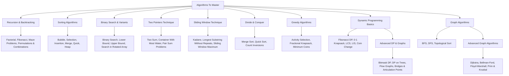

```mermaid
flowchart TD
    %% Root node
    Algorithms[Algorithms To Master]

    %% Main categories branching from root
    Algorithms --> Rec[Recursion & Backtracking]
    Algorithms --> Sort[Sorting Algorithms]
    Algorithms --> BS[Binary Search & Variants]
    Algorithms --> TP[Two Pointers Technique]
    Algorithms --> SW[Sliding Window Technique]
    Algorithms --> DC[Divide & Conquer]
    Algorithms --> Greedy[Greedy Algorithms]
    Algorithms --> DP[Dynamic Programming Basics]
    Algorithms --> Graph[Graph Algorithms]

    %% Recursion & Backtracking sub-algorithms
    Rec --> RecAlgos[Factorial, Fibonacci, Maze Problems, Permutations & Combinations]

    %% Sorting sub-algorithms
    Sort --> SortAlgos[Bubble, Selection, Insertion, Merge, Quick, Heap]

    %% Binary Search sub-algorithms
    BS --> BSAlgos[Binary Search, Lower Bound, Upper Bound, Search in Rotated Array]

    %% Two Pointers sub-algorithms
    TP --> TPAlgos[Two Sum, Container With Most Water, Pair Sum Problems]

    %% Sliding Window sub-algorithms
    SW --> SWAlgos[Kadane, Longest Substring Without Repeats, Sliding Window Maximum]

    %% Divide & Conquer sub-algorithms
    DC --> DCAlgos[Merge Sort, Quick Sort, Count Inversions]

    %% Greedy sub-algorithms
    Greedy --> GreedyAlgos[Activity Selection, Fractional Knapsack, Minimum Coins]

    %% Dynamic Programming sub-algorithms
    DP --> DPAlgos[Fibonacci DP, 0-1 Knapsack, LCS, LIS, Coin Change]
    DP --> AdvDP[Advanced DP & Graphs]
    AdvDP --> AdvDPAlgos[Bitmask DP, DP on Trees, Flow Graphs, Bridges & Articulation Points]

    %% Graph Algorithms
    Graph --> GraphAlgos[BFS, DFS, Topological Sort]
    Graph --> AdvGraph[Advanced Graph Algorithms]
    AdvGraph --> AdvGraphAlgos[Dijkstra, Bellman-Ford, Floyd-Warshall, Prim & Kruskal]

```