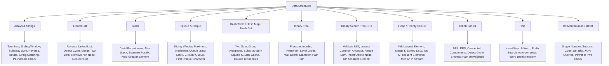

```mermaid
flowchart TD
    %% Root node
    DataStructures[Data Structures]

    %% Main categories branching from root
    DataStructures --> Arrays[Arrays & Strings]
    DataStructures --> LinkedList[Linked List]
    DataStructures --> Stack[Stack]
    DataStructures --> Queue[Queue & Deque]
    DataStructures --> Hash[Hash Table / Hash Map / Hash Set]
    DataStructures --> BT[Binary Tree]
    DataStructures --> BST[Binary Search Tree BST]
    DataStructures --> Heap[Heap / Priority Queue]
    DataStructures --> Graph[Graph Basics]
    DataStructures --> Trie[Trie]
    DataStructures --> Bit[Bit Manipulation / Bitset]

    %% Arrays & Strings problems
    Arrays --> ArraysAlgos[Two Sum, Sliding Window, Subarray Sum, Reverse, Rotate, String Matching, Palindrome Check]

    %% Linked List problems
    LinkedList --> LinkedListAlgos[Reverse Linked List, Detect Cycle, Merge Two Lists, Remove Nth Node, Reorder List]

    %% Stack problems
    Stack --> StackAlgos[Valid Parentheses, Min Stack, Evaluate Postfix, Next Greater Element]

    %% Queue & Deque problems
    Queue --> QueueAlgos[Sliding Window Maximum, Implement Queue using Stack, Circular Queue, First Unique Character]

    %% Hash Table problems
    Hash --> HashAlgos[Two Sum, Group Anagrams, Subarray Sum Equals K, LRU Cache, Count Frequencies]

    %% Binary Tree problems
    BT --> BTAlgos[Preorder, Inorder, Postorder, Level Order, Max Depth, Diameter, Path Sum]

    %% BST problems
    BST --> BSTAlgos[Validate BST, Lowest Common Ancestor, Range Sum, Insert/Delete Node, Kth Smallest Element]

    %% Heap / Priority Queue problems
    Heap --> HeapAlgos[Kth Largest Element, Merge K Sorted Lists, Top K Frequent Elements, Median in Stream]

    %% Graph Basics problems
    Graph --> GraphAlgos[BFS, DFS, Connected Components, Detect Cycle, Shortest Path Unweighted]

    %% Trie problems
    Trie --> TrieAlgos[Insert/Search Word, Prefix Search, Auto-complete, Word Break Problem]

    %% Bit Manipulation problems
    Bit --> BitAlgos[Single Number, Subsets, Count Set Bits, XOR Queries, Power of Two Check]
```